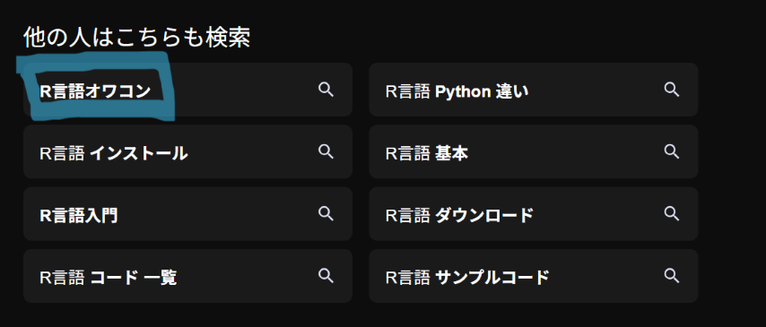
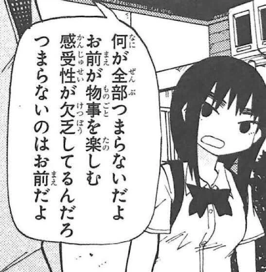

# 誰？

:::{.columns}
:::{.column width="30%"}
{.rounded-full}
:::

:::{.column width="70%"}
- あきる（[paithiov909](https://github.com/paithiov909)）というアカウントでインターネットしている
- 趣味でRパッケージをつくったりしている
:::
:::

# Tokyo.Rでありがちなこと

:::{.incremental}
- R言語の勉強会だから***統計やデータ分析についての高度な発表を準備しないとダメ***だと思ってない？
- たぶん、大事なのはそういうことじゃない
- ***自分なりのRの使い方***を共有することがポイント
:::

#

:::{.fukidashi-01-08}
[Q.「自分なりのR言語の使い方」を共有できるとどうしてRコミュニティ的にポイント高いのか🤔]{.center}
:::

#

:::{.fukidashi-01-08}
[A. 統計やデータ分析に興味があるのは一部のオタクだけだからです🤬]{.center}
:::

# R言語はオワコンなのか

## Rを取り巻く最近のトピック

:::{.incremental}
- tidyverseのエコシステムの成熟
- 新しいIDEやAIコーディングの普及（[Positron](https://positron.posit.co/), [btw](https://posit-dev.github.io/btw/), etc.）
- Positの人たちが構想している[R in Production](https://r-in-production.org/introduction.html)という路線
:::

### ✅むしろ着実に進化している{.fragment .fade-up}

## なぜオワコンに見えるのか

:::{.incremental}
1. Rユーザーの興味は***自分の役に立つかどうか***に偏りがち
2. ***データ分析には役に立たなそうな話***はコミュニティ内で広くは紹介されない
3. そういう***ふつうの使い方***はAIが代行してくれる
:::

:::{.r-stack}
{.fragment}

[➡もう終わってるコンテンツらしい…]{.fragment style="color: #f00; font-weight: bold; text-shadow: 1px 1px 1px #000;"}
:::

## オワコン化の流れに抵抗する

:::{.r-stack style="height: 80%;"}
{.fragment}

{.fragment}

[R言語がつまらないんじゃない<br />お前がおもしろくするんだよ！]{.fragment style="display: inline-block; text-align: center; font-size: 1.6em; color: hotpink; font-weight: bold; text-shadow: 4px 4px 4px #fff; background: #96e7e7c3; border-radius: 16px; padding: 16px; margin: 12px 0;"}
:::

[画像：阿部共実『死にたくなるしょうもない日々が死にたくなるくらいしょうもなくて死ぬほど死にたくない日々（１）』から]{style="color: #777; font-size: 0.4em;"}

## 自分なりのRの使い方を見つけよう

:::{style="color: #777;"}
- 「役に立つかどうか」だけでRを見ていると、あえてRの使用を検討する機会は縮小していく
- でも、その結果としてRがオワコンに見えているのだとしたら、視野が狭くなっているだけなのかもしれない
- Rの可能性を自分たちで狭めないことが、コミュニティを活気づけることにもつながるはず
:::

### 🔍新しいRの使い方を探しに行こう!!{.fragment .fade-up}

# R言語によるアートづくり

## Rでのアート制作文化（Rtistry）

[
  {.carousel-item}
  {.carousel-item}
  {.carousel-item}
  {.carousel-item}
]{.carousel}

[いずれも [koenderks/aRtsy](https://github.com/koenderks/aRtsy) からの抜粋]{style="color: #777; font-size: 0.7em;"}

## Rでアニメーションをつくる

:::{.incremental}
- 従来のggplot2によるRtistryは静止画のジェネラティブアートが主流
- でも私はどちらかというとプロシージャルなアニメーションがつくりたかった
- Rで映像素材をつくるためのパイプラインを開発してみることに
  - [skiagd](https://github.com/paithiov909/skiagd)
  - [rasengan](https://github.com/paithiov909/rasengan)
  - [aznyan](https://github.com/paithiov909/aznyan) / [nativeshadr](https://github.com/paithiov909/nativeshadr)
:::

## 実際のRコードの例

```r
library(skiagd)

cv_size <- dev_size()

n_frames <- 720
n_circles <- 50
radius <- runif(n_circles, min = .25, max = 2) |> sort()
trans <- matrix(c(60, 0, cv_size[1] / 2, 0, 60, cv_size[2] / 2, 0, 0, 1), ncol = 3)

circle <- \(amp, freq, phase) {
  amp * 1i^(freq * seq(0, 600, length.out = n_circles) + phase)
}

dir <- tempdir()
imgs <- purrr::imap_chr(seq(0, 4 * pi, length.out = n_frames + 1)[-1], \(a, i) {
  # Compute a stack of circles with changing amplitudes and phases
  l <- sin(pi * (2 * a - .5)) + 1
  z <- circle(pi / 6, -pi, 0) +
    circle(l, ceiling(a), -9 * cos(a) + 1) +
    circle(l / 2 - 1, ceiling((-a + (7 / 2)) %% 7) - 7, -7 * cos(a) + 1)

  hue <- (a + (Re(z / pi))) %% 1
  colours <- grDevices::hsv(hue, .66, .75, alpha = 1)

  # Build one frame
  png <- canvas("#04010F") |>
    add_circle(
      cbind(Re(z), Im(z), 1) %*% trans,
      radius = log(max(cv_size), exp(.5)) * radius,
      color = col2rgba(colours),
      props = paint(
        style = Style$Fill,
        blend_mode = BlendMode$Plus,
      )
    ) |>
    as_png()

  fp <- file.path(dir, sprintf("%04d.png", i))
  writeBin(png, fp)
  fp
})
```

## 実際のアニメーションの例



## なぜR言語なのか

:::{.incremental}
- クリエイティブコーディング向けのフレームワークやライブラリは他言語実装がたくさんある
- 他言語で便利にできることをそのままRでできるようにしてもそれほど嬉しくない
- むしろ重要なのは***Rらしい書き方ができる***こと
:::

### 🎯ただ「R言語でやってみる」のではなく、Rらしい体験をデザインするべき{.fragment .fade-up}

#

:::{.fukidashi-01-08}
[Q. ***R言語によるクリエイティブコーディング***とはどのような体験であるべきか🧐]{.center}
:::

#

:::{.fukidashi-01-08}
[A. ***時間を引数にしたデータ変換と画像生成パイプライン***としてクリエイティブコーディングするという体験]{.center}
:::

# RコードのRらしさって何だろう？

- [ア（@yuruyurau）](https://x.com/yuruyurau)さんによる[つぶやきProcessing](https://x.com/yuruyurau/status/1226846058728177665)作品から移植したコードを題材に考えてみる
- 実際の移植にあたっては[coolbutuseless/narademos](https://github.com/coolbutuseless/narademos)も参考にした


## p5.jsコードとの比較

:::{.panel-tabset}

## p5.jsで移植した例

:::{.columns}

:::{.column width="60%"}
```{=html}
<div id="cv-bubble-universe"></div>
```
:::
:::{.column width="40%"}
:::{style="color: #777;"}
  左図は画像ではなく、実際にp5.jsのスケッチを埋め込んでいる

  "c"キーで一時停止・再生
:::
:::

:::

## p5.jsコード

```js
const W = 540;
const N = 60;  // 元の作品では200だが、ここではひかえめにしている
let x, y, t;
let running = true;

// セットアップ
function setup() {
  let cnv = createCanvas(W, W, WEBGL);
  cnv.parent("cv-bubble-universe");

  x = 0; y = 0; t = 0; // 変数の初期化

  noStroke();     // ストロークをなしに
  blendMode(ADD); // ブレンドモードを加算に
  frameRate(3);   // 軽くするためにフレームレートを適当に下げる
}

// ループのなかで呼ばれる関数
function f(i, j) {
  // 座標の計算
  let r = TAU / N;
  let u = sin(i+y) + sin(r*i+x);
  let v = cos(i+y) + cos(r*i+x);
  x = u+t; y = v;

  fill(i, j, (v+2)*N/4);   // 色
  circle(u*N/2, v*N/2, 2); // この位置に直径2の円を描く
}

// フレームごとに呼ばれる描画処理
function draw() {
  if (!running) return; // 停止中は更新しない
  background(0); // 背景色で塗りつぶす
  scale(2.5);    // 全体を2.5倍に拡大

  // ループ
  for (i = 0; i < N; i++) {
    for (j = 0; j < N; j++) {
      f(i, j);
    }
  }
  t += 0.1; // tを増やす
}

function keyPressed() {
  if (key == 'c') {
    running = !running;
  }
}
```

## skiagdコード

```r

```

:::

## skiagdで描画した例



## skiagdコードの特徴 (1/2)

- データ駆動・宣言的な描画処理
  - [一つ一つの図形を描く処理を繰り返すのではなく、何をどこに描くかを表現するデータをあらかじめ用意しておいて一度に描画する]{style="color: #777;"}
- 純粋関数とパイプを使った書き方
  - [描画処理は時間$t$を受け取って対応するフレームを返す純粋関数と見なせる（外にある変数を書き換える副作用をもたない）]{style="color: #777;"}
  - [描画結果も副作用ではなく値として返されるので、それらをパイプでつなぎながら処理を書く]{style="color: #777;"}

## skiagdコードの特徴 (2/2)

- 対話的環境で素早く試行錯誤できる
  - [元データも描画結果も値なので、制作途中で部分実行して中身を確認することができる]{style="color: #777;"}
  - [パイプラインの一部を変更して試しに実行してみるコストがとても低い]{style="color: #777;"}
- 「Rらしさ」ゆえに書きにくい表現もある
  - [データが可変長、参照関係や履歴を保持するような状態遷移を含む場合、tidyverse的な表現では力不足]{style="color: #777;"}
  - [リアルタイムに近い描画ができるほど速くはない]{style="color: #777;"}
  - [命令的なインタラクションをもたない]{style="color: #777;"}

## たとえばこんな感じ

```{r}
#| label: fig1-bubble-universe
#| output-location: column
#| echo: true
#| fig-width: 7.5
#| fig-height: 7.5
library(skiagd)

W <- 540L
N <- 280L
tau <- 2 * pi

t <- 1.234

x <- y <- 0
r <- tau / N
dat <-
  tidyr::expand_grid(i = seq(N), j = seq(N)) |>
  dplyr::group_by(i) |>
  dplyr::group_modify(~ {
    xs <- ys <- double(N)
    for (j in .x$j) {
      u <- sin(.y$i + y) + sin(r * .y$i + x)
      v <- cos(.y$i + y) + cos(r * .y$i + x)
      x <<- u + t
      y <<- v
      xs[j] <- u
      ys[j] <- y
    }
    data.frame(
      x = xs,
      y = ys,
      z = 1,
      col = rgb(.y$i, .x$j, (y + 2) * N / 4, maxColorValue = N)
    )
  }) |>
  dplyr::ungroup()

dat

rast <-
  canvas("black") |>
  add_point(
    dat |>
      dplyr::select(x, y, z) |>
      as.matrix() %*%
      affiner::transform2d() %*%
      affiner::scale2d(N / 2) %*%
      affiner::translate2d(W / 2, W / 2),
    group = seq_len(nrow(dat)),
    color = dplyr::pull(dat, col) |>
      rasengan::spiral() |>
      col2rgba(),
    props = paint(
      width = 2,
      blend_mode = BlendMode$Plus,
    )
  ) |>
  as_nativeraster() |>
  aznyan::diffusion_filter(factor = 3) |>
  aznyan::median_blur()

grid::grid.newpage()
grid::grid.raster(rast, interpolate = FALSE)
```

## こんな感じもいいかも

```{r}
#| label: fig2-bubble-universe
#| output-location: column
#| echo: true
#| fig-width: 7.5
#| fig-height: 7.5
rast <-
  canvas("black") |>
  add_path(
    rep_len("M45 10 H55 V45 H90 V55 H55 V90 H45 V55 H10 V45 H45 Z", nrow(dat)),
    rsx_trans = dat |>
      dplyr::reframe(pos = cbind(x, y, z)) |>
      dplyr::mutate(
        pos = pos %*%
          affiner::transform2d() %*%
          affiner::scale2d(N / 2) %*%
          affiner::translate2d(W / 2, W / 2)
      ) |>
      dplyr::reframe(
        sc = .1,
        rot = atan2(pos[, 2], pos[, 1]),
        x = pos[, 1],
        y = pos[, 2],
        ax = 50,
        ay = 50
      ),
    color = dplyr::pull(dat, col) |>
      rasengan::spiral() |>
      col2rgba(),
    props = paint(
      width = 1,
      blend_mode = BlendMode$Screen,
      style = Style$Fill,
    )
  ) |>
  as_nativeraster() |>
  aznyan::box_blur()

grid::grid.newpage()
grid::grid.raster(rast, interpolate = FALSE)
```

# Rで書くことのモチベーション

- R言語は、***コード片を小さく実行してみるステップを繰り返しながら、素早くプロトタイプをつくっていく***ことに向いている
- ***関数型らしい書き心地としては不完全なところ***がかえって書きやすさに繋がっている
- パイプで処理をつなぐことを意識しつつ、***値を返すことを徹底する***と体験がよい

# まとめ

:::{.incremental}
- 「役に立つ範囲」だけを眺めていると、Rはすぐにつまらなくなりがち
- ぶっちゃけRでやらなくてもいい。でも、Rでやってみたら新しい発見があるかも
- 自分なりのRの使い方を探して、コミュニティに共有してみよう！
:::

# Enjoy✨{.center}
