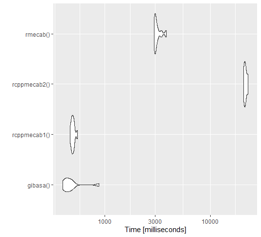

# gibasa（日本語テキスト分析のためのRパッケージ）の紹介

あきる（paithiov909）


---

### 誰？

- あきる（[@paithiov909](https://twitter.com/paithiov909)）という名前でTwitterしてます
- テキスト分析とかが好き

### 話すこと

- gibasa（日本語テキスト分析のための自作パッケージ）の紹介
  - [gibasa: An Alternate 'Rcpp' Interface to 'MeCab'](https://github.com/paithiov909/gibasa)

---

## テキスト分析は「テキスト」の何をどう分析したいのか？

- テキスト分析＝テキスト（文章）の特徴に対するデータ分析のこと
- テキストの特徴を把握したうえで何らかの知見を得たい
  - 値やカテゴリの予測をする
  - グループに分けてそれぞれの違いを評価する
  - テキストに独特な特徴を調べる

---

## テキスト（文章）の特徴とは

- それぞれのテキストについて「何か」を数えた頻度や比率（またはそれらを変換したもの）
- ここで数えたい「何か」とは
  - 単語など、適当な長さの短い単位
  - それらのNgramや共起
  - その他の情報（たとえば「品詞の種類」「関東の地名」「身体の部位を表す単語」など）

---

## テキスト分析のための前処理

- 日本語テキストでは、分析をはじめる前に、それぞれのテキストについて、数えたい「何か」のかたちに加工する必要がある
- つまり、まずは単語の分かち書きのかたちにしたい場合が多い

```
すももももももものうち
#> すもも も もも も もも の うち
```

- どうやって？

---

## 分かち書きするための道具

|     | 手法 | Rパッケージ |
| --- | --- | --- |
| ICU | ルールベース | stringi (audubon, tokenizers, quanteda) |
| MeCab | 形態素解析 | RMeCab, RcppMeCab, gibasa |
| Sudachi | 形態素解析 | sudachir |
| Sentencepiece | 機械学習 | sentencepiece |
| Byte Pair Encoding | 機械学習 | tokenizers.bpe |
| Universal Dependencies | 訓練済みモデル | spacyr, udpipe (cleanNLP) |

---

## gibasaパッケージでやりたいこと


---

## gibasa::tokenize & gibasa::prettify

データフレーム中の日本語テキスト列についてtidy text（data frame of tokens）に整形する

```r
audubon::polano[5]
#> [1] "そのころわたくしは、モリーオ市の博物局に勤めて居りました。"
res <-
  data.frame(
    doc_id = seq_len(length(audubon::polano[5:800])),
    text = audubon::polano[5:800]
  ) |>
  gibasa::tokenize(text, doc_id) |>
  gibasa::prettify(into = gibasa::get_dict_features("ipa"))

dplyr::slice_head(res, n = 5L)
#>   doc_id sentence_id token_id    token   POS1   POS2     POS3 POS4 X5StageUse1 X5StageUse2 Original    Yomi1    Yomi2
#> 1      1           1        1     その 連体詞   <NA>     <NA> <NA>        <NA>        <NA>     その     ソノ     ソノ
#> 2      1           1        2     ころ   名詞 非自立 副詞可能 <NA>        <NA>        <NA>     ころ     コロ     コロ
#> 3      1           1        3 わたくし   名詞 代名詞     一般 <NA>        <NA>        <NA> わたくし ワタクシ ワタクシ
#> 4      1           1        4       は   助詞 係助詞     <NA> <NA>        <NA>        <NA>       は       ハ       ワ
#> 5      1           1        5       、   記号   読点     <NA> <NA>        <NA>        <NA>       、       、       、
```

---

## gibasa::pack

tidy text（data frame of tokens）を分かち書きされたコーパス（data frame of corpus）に整形する

```r
res |>
  gibasa::pack() |>
  dplyr::slice_head()
#>   doc_id                                                                       text
#> 1      1 その ころ わたくし は 、 モリーオ 市 の 博物 局 に 勤め て 居り まし た 。
```

---

## gibasaの速さについて (1/2)

```r
rmecab <- \() { ## RMeCab v1.0.7
  purrr::imap_dfr(
    audubon::polano[5:800],
    ~ data.frame(
      doc_id = .y,
      tibble::enframe(unlist(RMeCab::RMeCabC(.x)), "POS1", "token")
    )
  )
}
rcppmecab1 <- \() { ## junhewk/RcppMeCab v0.0.1.3-2
  purrr::imap_dfr(
    RcppMeCab::posParallel(audubon::polano[5:800], join = FALSE),
    ~ data.frame(doc_id = .y, token = unname(.x), POS1 = names(.x))
  )
}
rcppmecab2 <- \() { RcppMeCab::posParallel(audubon::polano[5:800], format = "data.frame") }
gibasa <- \() { ## paithiov909/gibasa v0.3.0
  gibasa::gbs_tokenize(audubon::polano[5:800]) |>  gibasa::prettify(col_select = "POS1")
}
```

---

## gibasaの速さについて (2/2)

- 条件にもよるが、少なくともdoc_idとtoken、POS1列を含むtidy textを得たい場合では、RcppMeCabと変わらないくらい
- それ以外の列もほしい場合なら、十分実用に耐えるくらいの速さ



---

## どういうときにgibasaを使う？

tidy text（data frame of tokens）のかたちのデータフレームがほしくて、次にあてはまるとき

1. RMeCabの関数では返されない素性情報が必要な場合
2. IPA辞書以外の辞書（[UniDic](https://ccd.ninjal.ac.jp/unidic/), [CC-CEDICT](https://github.com/ueda-keisuke/CC-CEDICT-MeCab), [mecab-ko-dic](https://bitbucket.org/eunjeon/mecab-ko-dic/src/master/)）を使いたい場合

---

## おわり

試してみてね！
