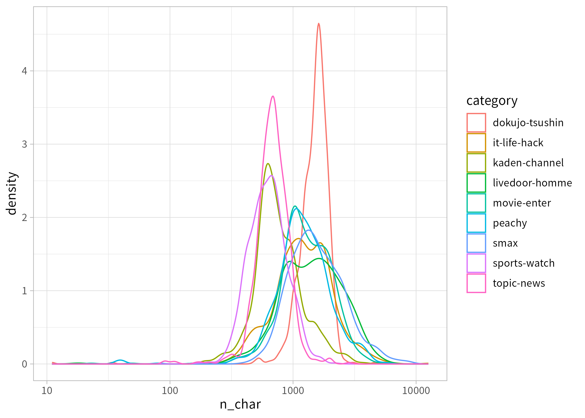

# Rでの日本語形態素解析事情 2025年2月


## この文章について

`RMeCab::docDF()`は、文章中の単語について、これ一つでいろいろな数え方ができる便利な関数だ。一方で、雑に使ってしまうと処理に異常に時間がかかったり、MeCabの機嫌によってRセッションごと爆発したりもする、扱いづらい関数でもある。

ここでは、まず、`docDF()`を雑に使った場合に異常に時間がかかる理由について説明したうえで、`minFreq`を十分に大きめに設定すれば、そうした事態は回避できることを紹介する。一方で、`docDF()`は、そもそも抽出した単語をフィルタするための閾値をさまざまに調整しながら使う用途には向いておらず、そういうことをしたい場合、解析速度の面からも、gibasaなど別の形態素解析の手段を使ったほうがよいことを説明する。

## 戻り値がデカすぎる問題

というわけで、まず、`RMecab::docDF()`を雑に使った場合に異常に時間がかかる理由について説明する。ここでは`docDF()`に雑に与えたときに、そこそこ異常に時間がかかるだろう日本語コーパスの例として、livedoorニュースコーパスを読み込んでおく。

このコーパスは[ldccr](https://github.com/paithiov909/ldccr)というパッケージを使って、次のように簡単に読み込める。

``` r
dat <-
  ldccr::read_ldnws(exdir = tempdir(), include_title = FALSE) |>
  dplyr::mutate(
    doc_id = ldccr::sqids(),
    title = stringi::stri_trans_nfkc(title),
    text = stringi::stri_trans_nfkc(body)
  ) |>
  dplyr::select(doc_id, category, title, text)
#> Parsing dokujo-tsushin...
#> Parsing it-life-hack...
#> Parsing kaden-channel...
#> Parsing livedoor-homme...
#> Parsing movie-enter...
#> Parsing peachy...
#> Parsing smax...
#> Parsing sports-watch...
#> Parsing topic-news...
#> Done.

dat
#> # A tibble: 7,367 × 4
#>    doc_id      category       title                                        text
#>    <chr>       <fct>          <chr>                                        <chr>
#>  1 se8fMjYzCtd dokujo-tsushin 友人代表のスピーチ、独女はどうこなしている?  " もう…
#>  2 qT3fn1M59E0 dokujo-tsushin ネットで断ち切れない元カレとの縁             " 携帯…
#>  3 GKUXVcgT98l dokujo-tsushin 相次ぐ芸能人の“すっぴん”披露 その時、独女の心境は?…… " 「男…
#>  4 W40lYr546YF dokujo-tsushin ムダな抵抗!? 加齢の現実                      " ヒッ…
#>  5 fk9LpWmkdq5 dokujo-tsushin 税金を払うのは私たちなんですけど!            " 6月…
#>  6 IPvFoBR26YM dokujo-tsushin 読んでみる?描いてみる?大人の女性を癒す絵本の魅力…… " 書店…
#>  7 V0XqBmtTUuG dokujo-tsushin 大人になっても解決しない「お昼休み」という問題…… " 昨年…
#>  8 RneKxNiST74 dokujo-tsushin 結婚しても働くのはなぜ? 既婚女性のつぶやき   " 「彼…
#>  9 dv4RWw390v5 dokujo-tsushin お肌に優しいから安心 紫外線が気になる独女の夏の対策とは?…… " これ…
#> 10 5bQL9ZfJoA5 dokujo-tsushin 初回デートで婚カツ女子がゲンメツする行為って?…… " 合コ…
#> # ℹ 7,357 more rows
```

このコーパスは、本来は9カテゴリの文書分類タスクを試すためのもので、コーパス全体としては7,367文書のブログ記事が収録されている。文章量としては1,000字前後のものが多い。

``` r
library(ggplot2)
dat |>
  dplyr::mutate(n_char = stringr::str_count(text)) |>
  ggplot(aes(x = n_char, color = category)) +
  geom_density() +
  scale_x_log10() +
  theme_light()
```

<!--  -->


このコーパスを読み込んだデータフレームの（Rのオブジェクトとしての）メモリ上でのサイズは25MBくらい。もちろん、これらの記事の中身を全部読もうとするとかなりつらいだろうし、そういう意味でこれはけっして少ない量ではないのだが、しかし、こんなのは余裕でメモリに載る程度なので、大規模というほどではない。

``` r
lobstr::obj_sizes(dplyr::pull(dat, text))
#> 24.93 MB
```

実際、これくらいの規模の文章集合だったら、ただ形態素解析するだけであれば、手元の環境だとgibasaで数秒でできる。

``` r
microbenchmark::microbenchmark(
  gibasa = {
    toks <- gibasa::tokenize(dat, text, doc_id)
  },
  times = 1
)
#> Unit: seconds
#>    expr      min       lq     mean   median       uq      max neval
#>  gibasa 4.762919 4.762919 4.762919 4.762919 4.762919 4.762919     1
toks
#> # A tibble: 4,767,480 × 7
#>    doc_id      category       title           sentence_id token_id token feature
#>    <fct>       <fct>          <chr>                 <int>    <int> <chr> <chr>
#>  1 se8fMjYzCtd dokujo-tsushin 友人代表のスピーチ、独女はど…           1        1 もうすぐ… 副詞,一般,…
#>  2 se8fMjYzCtd dokujo-tsushin 友人代表のスピーチ、独女はど…           1        2 ジューン… 名詞,固有名…
#>  3 se8fMjYzCtd dokujo-tsushin 友人代表のスピーチ、独女はど…           1        3 ・    記号,一般,…
#>  4 se8fMjYzCtd dokujo-tsushin 友人代表のスピーチ、独女はど…           1        4 ブライド… 名詞,一般,…
#>  5 se8fMjYzCtd dokujo-tsushin 友人代表のスピーチ、独女はど…           1        5 と    助詞,格助詞…
#>  6 se8fMjYzCtd dokujo-tsushin 友人代表のスピーチ、独女はど…           1        6 呼ば  動詞,自立,…
#>  7 se8fMjYzCtd dokujo-tsushin 友人代表のスピーチ、独女はど…           1        7 れる  動詞,接尾,…
#>  8 se8fMjYzCtd dokujo-tsushin 友人代表のスピーチ、独女はど…           1        8 6     名詞,数,*…
#>  9 se8fMjYzCtd dokujo-tsushin 友人代表のスピーチ、独女はど…           1        9 月    名詞,一般,…
#> 10 se8fMjYzCtd dokujo-tsushin 友人代表のスピーチ、独女はど…           1       10 。    記号,句点,…
#> # ℹ 4,767,470 more rows
```

IPA辞書で解析したところ、延べ語数は4,767,480語だった。これを適当に数えあげて、文書単語行列をつくってみよう。

``` r
dtm <- toks |>
  dplyr::count(doc_id, token) |>
  tidytext::cast_sparse(doc_id, token, n)

dim(dtm)
#> [1]  7367 74318
lobstr::obj_sizes(dtm)
#> 28.84 MB
```

7,367文書×74,318語の行列になった。疎行列オブジェクトとして持つ場合、データとして格納される数値の数は縦長のカウントデータのときと変わらない。この文書単語行列のメモリ上でのサイズは28MBほどであり、これもサイズとしては全然小さい。

一方で、7,000文書×70,000語の行列をふつうの密なオブジェクトとして持とうとした場合、それだけで3.92GBになる。

``` r
lobstr::obj_sizes(numeric(7000 * 70000))
#> 3.92 GB
gc()
#>            used  (Mb) gc trigger   (Mb)  max used   (Mb)
#> Ncells  2520124 134.6    7433249  397.0   9291561  496.3
#> Vcells 38322278 292.4  508863983 3882.4 528345638 4031.0
```

ちなみに、Rでは、行列と同じだけの要素をデータフレームとして持とうとすると、一般にさらに余分にメモリを消費する。7,000行×70,000列くらいの大きさのデータフレームとなると、まあメモリには載るかもしれないが、できればつくりたいものではない。

``` r
lobstr::obj_sizes(
  matrix(0, nrow = 100, ncol = 1000),
  # この持ち方はよくない
  as.data.frame(matrix(0, nrow = 100, ncol = 1000)),
  # Rのデータフレームは列指向なので、列方向に長くもつほうが容量を小さくできる
  as.data.frame(t(matrix(0, nrow = 100, ncol = 1000)))
)
#> * 800.22 kB
#> * 920.61 kB
#> * 806.72 kB
gc()
#>            used  (Mb) gc trigger   (Mb)  max used   (Mb)
#> Ncells  2520173 134.6    7433249  397.0   9291561  496.3
#> Vcells 38322403 292.4  407091187 3105.9 528345638 4031.0
```

`RMeCab::docDF()`は、単語文書行列をデータフレームとして返そうとするが、たとえば今回のデータについて雑に使ってしまうと、70,000×7,000みたいな規模のデータフレーム（少なくとも3.92GBくらいにはなるはず！）をつくろうとしてしまう。これが`docDF()`を雑に使ったときに異常に遅くなる主な原因であり、`docDF()`を使っていてこういう事態が発生すると、長い時間が経った後で「メモリが足りなくてxxGBのオブジェクトはつくれません」みたいな意味のエラーメッセージが出たりする。

## docDFは上手く使うと速い

じゃあ`RMeCab::docDF()`は使えないやつなのかというと、そんなことはなく、むしろ、単語を数えあげる関数としては速い。ただ、C++側で単語を数えあげた結果をRのデータフレームに持ち直すのに時間がかかるため、`number of extracted terms`が増えると、そこからまともに動かなくなりがち。だから、形態素解析する文章の量に対して`minFreq`を十分に大きめに設定してやれば、だいたいサクッと動かせる。

たとえば、`docDF()`の結果をtidyな感じに整形して返す、いい感じのラッパーを次のように用意したとする。

``` r
docdf_rmecab <- function(dat,
                         text_field, docid_field,
                         minFreq = floor(sqrt(nrow(dat))) * 2,
                         count_genkei = FALSE) {
  text_field <- rlang::enquo(text_field)
  docid_field <- rlang::enquo(docid_field)

  # if docid is a factor, preserve ordering
  col_names <- rlang::as_name(docid_field)
  if (is.factor(dat[[col_names]])) {
    col_u <- levels(dat[[col_names]])
  } else {
    col_u <- unique(dat[[col_names]])
  }
  pos_text <- tidyselect::eval_select(text_field, dat)

  rmecab_res <-
    RMeCab::docDF(dat,
      column = pos_text, minFreq = minFreq,
      type = 1, Genkei = as.numeric(!count_genkei), weight = "tf*idf"
    )
  ndocs <- ncol(rmecab_res) - 3

  tidyr::pivot_longer(
    rmecab_res,
    cols = starts_with("Row"),
    names_to = "doc_id",
    values_to = "tf_idf",
    names_transform = \(.x) {
      stringr::str_remove(.x, "Row")
    },
    values_transform = list(tf_idf = \(.x) {
      ifelse(.x == 0, NA_integer_, .x)
    }),
    values_drop_na = TRUE
  ) |>
    dplyr::arrange(as.integer(doc_id)) |>
    dplyr::mutate(
      doc_id = as.integer(doc_id),
      doc_id = factor(doc_id, labels = col_u[unique(doc_id)]),
      token = TERM,
      POS1 = dplyr::if_else(POS1 == "*", NA_character_, POS1),
      POS2 = dplyr::if_else(POS2 == "*", NA_character_, POS2),
      tf_idf = tf_idf
    ) |>
    dplyr::distinct(doc_id, token, POS1, POS2, tf_idf)
}

docdf_rmecab(dat[1:5, ], text, doc_id) |>
  dplyr::filter(token %in% c("独", "女"))
#> number of extracted terms = 168
#> now making a data frame. wait a while!
#> # A tibble: 8 × 5
#>   doc_id      token POS1  POS2     tf_idf
#>   <fct>       <chr> <chr> <chr>     <dbl>
#> 1 se8fMjYzCtd 女    名詞  一般       5.29
#> 2 se8fMjYzCtd 独    名詞  固有名詞   5.29
#> 3 qT3fn1M59E0 女    名詞  一般       2.64
#> 4 qT3fn1M59E0 独    名詞  固有名詞   2.64
#> 5 GKUXVcgT98l 女    名詞  一般       5.29
#> 6 GKUXVcgT98l 独    名詞  固有名詞   5.29
#> 7 fk9LpWmkdq5 女    名詞  一般       2.64
#> 8 fk9LpWmkdq5 独    名詞  固有名詞   2.64
```

これは、gibasaを使って書き直すと、だいたい次のような処理になる（`dplyr::add_count()`で単語を数えているので、こちらでは文書内での語の順番が戻り値でも保持されている）。

``` r
docdf_gibasa <- function(dat,
                         text_field, docid_field,
                         minFreq = floor(sqrt(nrow(dat))) * 2) {
  text_field <- rlang::enquo(text_field)
  docid_field <- rlang::enquo(docid_field)
  gibasa::tokenize(dat, !!text_field, !!docid_field) |>
    gibasa::prettify(col_select = c("POS1", "POS2")) |>
    dplyr::mutate(TERM = paste(token, POS1, POS2, sep = "/")) |>
    dplyr::add_count(doc_id, TERM) |>
    # minFreqはTERMが出現する文書頻度の閾値
    dplyr::filter(sum(n > 0) >= minFreq, .by = TERM) |>
    # 文書がまるごと取り除かれた場合にbind_tf_idf2に怒られるので、出現しないdoc_idについてはdropする
    dplyr::mutate(doc_id = forcats::fct_drop(doc_id)) |>
    gibasa::bind_tf_idf2(TERM, doc_id, norm = FALSE) |>
    dplyr::mutate(tf_idf = n * idf) |>
    dplyr::distinct(doc_id, token, POS1, POS2, tf_idf)
}

docdf_gibasa(dat[1:5, ], text, doc_id) |>
  dplyr::filter(token %in% c("独", "女"))
#> # A tibble: 8 × 5
#>   doc_id      token POS1  POS2     tf_idf
#>   <fct>       <chr> <chr> <chr>     <dbl>
#> 1 se8fMjYzCtd 独    名詞  固有名詞   5.29
#> 2 se8fMjYzCtd 女    名詞  一般       5.29
#> 3 qT3fn1M59E0 独    名詞  固有名詞   2.64
#> 4 qT3fn1M59E0 女    名詞  一般       2.64
#> 5 GKUXVcgT98l 独    名詞  固有名詞   5.29
#> 6 GKUXVcgT98l 女    名詞  一般       5.29
#> 7 fk9LpWmkdq5 独    名詞  固有名詞   2.64
#> 8 fk9LpWmkdq5 女    名詞  一般       2.64
```

これらの関数に`dat`をまるごと与えて比較してみる。

``` r
microbenchmark::microbenchmark(
  gibasa = docdf_gibasa(dat, text, doc_id) |>
    dplyr::distinct(doc_id, tf_idf) |>
    dplyr::arrange(doc_id, tf_idf),
  rmecab = docdf_rmecab(dat, text, doc_id) |>
    dplyr::distinct(doc_id, tf_idf) |>
    dplyr::arrange(doc_id, tf_idf),
  times = 1,
  check = "equal"
)
#> number of extracted terms = 2631
#> now making a data frame. wait a while!
#>
#> Unit: seconds
#>    expr      min       lq     mean   median       uq      max neval
#>  gibasa 28.23764 28.23764 28.23764 28.23764 28.23764 28.23764     1
#>  rmecab 43.76040 43.76040 43.76040 43.76040 43.76040 43.76040     1
```

それでもgibasaを使っているほうが速そうに見えるものの、これは`floor(sqrt(nrow(dat))) * 2`が抽出する単語の閾値としては小さすぎるからで、文書数に対してもっと`minFreq`を強気に設定して、戻り値が1,000列前後くらいになるようにしてやると、RMeCabのほうが速かったりする。

``` r
microbenchmark::microbenchmark(
  gibasa = docdf_gibasa(dat[1:1000, ], text, doc_id) |>
    dplyr::distinct(doc_id, tf_idf) |>
    dplyr::arrange(doc_id, tf_idf),
  rmecab = docdf_rmecab(dat[1:1000, ], text, doc_id) |>
    dplyr::distinct(doc_id, tf_idf) |>
    dplyr::arrange(doc_id, tf_idf),
  times = 1,
  check = "equal"
)
#> number of extracted terms = 1224
#> now making a data frame. wait a while!
#>
#> Unit: seconds
#>    expr      min       lq     mean   median       uq      max neval
#>  gibasa 4.440494 4.440494 4.440494 4.440494 4.440494 4.440494     1
#>  rmecab 3.735932 3.735932 3.735932 3.735932 3.735932 3.735932     1
```

## 試行錯誤したい処理は切り分けよう

とはいえ、`RMeCab::docDF()`を使うとき、私たちはべつに`docDF()`を上手く動かすことを目的としているのではない。ようするに、単語を数えたいはずなのだ。`docDF()`を上手く動かすことに専念するあまり、`minFreq`を大きくしすぎて、注目するべき単語を抽出できなくなってしまうのでは、元も子もない。

`docDF()`の`minFreq`がするように、抽出された単語を文書頻度などにもとづいてフィルタするのはよくおこなわれることだが、実際にどれくらいの閾値を設定するかは、単語を抽出してみた後でないと決めにくいことが多い。したがって、`docDF()`で文書頻度の閾値を変えながら試行錯誤しようとすると、`minFreq`の値を変えながら`docDF()`を何回も実行してみることになるのだが、それだと、そのたびごとにコーパス全体を形態素解析して、単語を数えあげ、何十秒かかけて結果をデータフレームに変換する処理が走ることになり、しかも、`minFreq`が大きすぎるとそもそも戻り値がメモリに載らないなんてことまで起こったりする。

たぶん`docDF()`は、そういう試行錯誤をするのにはあまり向いていない。こういった試行錯誤を要するシーンでは、ふつう、試行錯誤の各ステップを短いスパンで実行できるようにしておくほうがストレスが溜まりにくい。だから、たとえば`docDF()`で実現したいような処理でいえば、文章を分かち書きするステップ・単語を数えあげるステップと、単語を文書頻度などによってフィルタするステップとは、あらかじめ切り分けて実装しておいたほうが便利だろうと思われる。

つまり、こういうのと、

``` r
toks <-
  gibasa::tokenize(dat, text, doc_id) |>
  gibasa::prettify(col_select = c("POS1", "POS2")) |>
  dplyr::mutate(token = paste(token, POS1, POS2, sep = "/")) |>
  dplyr::count(doc_id, token)
```

こういうのは、分けておいたほうがいいでしょ、という話だ。

``` r
minFreq <- 100 ## この値を変えながらいろいろ試行錯誤してみればいい

dtm <- toks |>
  dplyr::filter(sum(n > 0) >= minFreq, .by = token) |>
  dplyr::mutate(doc_id = forcats::fct_drop(doc_id)) |>
  gibasa::bind_tf_idf2(token, doc_id) |>
  dplyr::mutate(tf_idf = n * idf) |>
  tidytext::cast_sparse(doc_id, token, tf_idf)

str(dtm)
#> Formal class 'dgCMatrix' [package "Matrix"] with 6 slots
#>   ..@ i       : int [1:1420472] 0 9 12 15 20 26 27 28 31 38 ...
#>   ..@ p       : int [1:3026] 0 1353 1596 7800 13783 15080 15420 15558 17638 17899 ...
#>   ..@ Dim     : int [1:2] 7367 3025
#>   ..@ Dimnames:List of 2
#>   .. ..$ : chr [1:7367] "se8fMjYzCtd" "qT3fn1M59E0" "GKUXVcgT98l" "W40lYr546YF" ...
#>   .. ..$ : chr [1:3025] "!」/名詞/サ変接続" "!』/名詞/サ変接続" "(/名詞/サ変接続" ")/名詞/サ変接続" ...
#>   ..@ x       : num [1:1420472] 6.89 3.44 3.44 3.44 6.89 ...
#>   ..@ factors : list()
```

## RMeCabCはあまり速くない

こういうやり方をするなら、ようは分かち書きできればいいわけなので、`RMeCab::RMeCabC()`を使えばいいのではという話にもなる。実際、`lapply(dat$text, \(x) unlist(RMeCab::RMeCabC(x)))`というのは、非常によく見かけるコードだ。しかし、これは、分かち書きをする処理としてはあまり速くない。

``` r
microbenchmark::microbenchmark(
  gibasa = gibasa::tokenize(dat$text) |>
    gibasa::prettify(col_select = c("POS1", "Original")) |>
    dplyr::mutate(token = dplyr::if_else(is.na(Original), token, Original)) |>
    gibasa::as_tokens() |>
    unname(),
  rmecab = lapply(dat$text, \(x) unlist(RMeCab::RMeCabC(x, mypref = 1))),
  times = 1,
  check = "equal"
)
#> Unit: seconds
#>    expr      min       lq     mean   median       uq      max neval
#>  gibasa 10.90253 10.90253 10.90253 10.90253 10.90253 10.90253     1
#>  rmecab 15.49842 15.49842 15.49842 15.49842 15.49842 15.49842     1
```

gibasaを使っているコードのほうがいろいろごちゃごちゃやっているのにもかかわらず、`RMeCabC()`を使っているコードのほうが遅い。いちおう断っておくと、これはべつにRMeCabの実装が悪いのではなく、大部分は`lapply()`が長いベクトルを渡したときに遅いせいである。品詞情報がまったくいらない場合、次のようにもできるが、それにしても遅い。

``` r
microbenchmark::microbenchmark(
  gibasa = {
    toks <- gibasa::tokenize(dat$text, mode = "wakati")
    unname(toks)
  },
  rmecab = lapply(dat$text, \(x) unlist(RMeCab::RMeCabC(x), use.names = FALSE)),
  times = 1,
  check = "equal"
)
#> Unit: seconds
#>    expr       min        lq      mean    median        uq       max neval
#>  gibasa  3.751153  3.751153  3.751153  3.751153  3.751153  3.751153     1
#>  rmecab 14.697065 14.697065 14.697065 14.697065 14.697065 14.697065     1

str(toks[1:2])
#> List of 2
#>  $ 1: chr [1:796] "もうすぐ" "ジューン" "・" "ブライド" ...
#>  $ 2: chr [1:738] "携帯" "電話" "が" "普及" ...
```

ちなみに、RMeCabには、データフレームを引数として`RMeCabC()`と同じようなことができる`RMeCab::RMeCabDF()`という関数もある。が、これは実は`RMeCabC()`のラッパーであり、指定したデータフレームの列に対してforループのなかで`RMeCabC() |> unlist()`しているだけなので、上の処理とやっていることは変わらない。

`RMeCabDF()`を使うと、たとえば次のような書き方ができるが、処理にかかる時間はここまでの例とほぼ同じになる。

``` r
df_gibasa <- function(dat, text_field, docid_field) {
  text_field <- rlang::enquo(text_field)
  docid_field <- rlang::enquo(docid_field)
  gibasa::tokenize(dat, !!text_field, !!docid_field) |>
    gibasa::prettify(col_select = "POS1") |>
    dplyr::select(doc_id, token, POS1)
}

df_rmecab <- function(dat, text_field, docid_field) {
  text_field <- rlang::enquo(text_field)
  docid_field <- rlang::enquo(docid_field)

  # if docid is a factor, preserve ordering
  col_names <- rlang::as_name(docid_field)
  if (is.factor(dat[[col_names]])) {
    col_u <- levels(dat[[col_names]])
  } else {
    col_u <- unique(dat[[col_names]])
  }
  pos_text <- tidyselect::eval_select(text_field, dat)
  docid_field <- dat[[col_names]]

  RMeCab::RMeCabDF(dat, pos_text) |>
    rlang::as_function(~ {
      sizes <- lengths(.)
      ret <- unlist(.)
      dplyr::tibble(
        doc_id = factor(rep(docid_field, sizes), levels = col_u),
        token = unname(ret),
        POS1 = names(ret)
      )
    })()
}

microbenchmark::microbenchmark(
  gibasa = df_gibasa(dat, text, doc_id),
  rmecab = df_rmecab(dat, text, doc_id),
  times = 1,
  check = "equal"
)
#> Unit: seconds
#>    expr       min        lq      mean    median        uq       max neval
#>  gibasa  9.395185  9.395185  9.395185  9.395185  9.395185  9.395185     1
#>  rmecab 16.606452 16.606452 16.606452 16.606452 16.606452 16.606452     1
```

## まとめ

### gibasaを使ったほうがいいよ

以上のことから、実用上`RMeCab::docDF()`だと遅いと感じられるようなシーンでは、RMeCabよりもgibasaを使ったほうがよいと思う。gibasaの詳しい使い方については、次を読んでください。

- [An Alternative Rcpp Wrapper of MeCab •
  gibasa](https://paithiov909.github.io/gibasa/)
- [RとMeCabによる日本語テキストマイニングの前処理](https://paithiov909.github.io/textmining-ja/)

なお、ここではわざわざ比較していないが、Rで日本語の分かち書きやトークナイズをおこなえるパッケージは、ほかにもいくつか存在する。ただ、この後で紹介するRcppJaggerを除けば、いずれも分かち書きをする手段として見るかぎりでは、RMeCabと比べても圧倒的に遅い。たとえば[spacyr](https://github.com/quanteda/spacyr)などは、がんばればたぶん動かせるはずだが、RからreticulateでspaCyを使うくらいだったら、そもそも最初からPythonを使ったほうがいい疑惑もあり、あまりオススメしない。

### gibasaでも満足できない場合

gibasaはC++側でのマルチスレッド処理のバックエンドとしてRcppParallelを使っているため、oneTBBと相性が悪いハードウェアを使っていると、謎のバグを引いてしまう恐れがある。いちおう`Sys.setenv(RCPP_PARARELL_BACKEND="tinythread")`
とかするとバックエンドを切り替えられるはずだが、それで使えるようになるかは未検証。

最近、[vibrato](https://github.com/daac-tools/vibrato)というRust実装の形態素解析器をラップした[vibrrt](https://github.com/paithiov909/vibrrt)というRパッケージもつくっていて、そちらはシングルスレッドなので安全な気がするが、将来的にもgibasaほどは速くはならないと思う。

もっと究極の処理速度を求めている場合、日本語の形態素解析をおこなうRパッケージとしては[RcppJagger](https://github.com/Shusei-E/RcppJagger)がおそらくもっとも処理が速い。[Jagger](https://www.tkl.iis.u-tokyo.ac.jp/~ynaga/jagger/)は、次の論文で提案された形態素解析器のC++実装で、現状、日本語の形態素解析器としては最速のものだと思われる。

> Naoki Yoshinaga [Back to Patterns: Efficient Japanese Morphological
> Analysis with Feature-Sequence
> Trie](https://aclanthology.org/2023.acl-short.2/) The 61st Annual
> Meeting of the Association for Computational Linguistics (ACL-23).
> Toronto, Canada. July 2023

ただし、RcppJagger（というかJagger）はそれほど扱いやすくはなく、とくにライセンス的に問題ないかたちで辞書を用意するのがたぶんとても難しいはずなので、現実的には研究用途でしか使えないような気がする。

## セッション情報

``` r
sessioninfo::session_info()
#> ─ Session info ───────────────────────────────────────────────────────────────
#>  setting  value
#>  version  R version 4.4.2 (2024-10-31)
#>  os       Ubuntu 24.04.2 LTS
#>  system   x86_64, linux-gnu
#>  ui       X11
#>  language (EN)
#>  collate  ja_JP.UTF-8
#>  ctype    ja_JP.UTF-8
#>  tz       Asia/Tokyo
#>  date     2025-02-18
#>  pandoc   3.1.3 @ /usr/bin/ (via rmarkdown)
#>  quarto   1.6.40 @ /opt/quarto/bin/quarto
#>
#> ─ Packages ───────────────────────────────────────────────────────────────────
#>  package        * version    date (UTC) lib source
#>  bit              4.5.0.1    2024-12-03 [1] CRAN (R 4.4.2)
#>  bit64            4.6.0-1    2025-01-16 [1] CRAN (R 4.4.2)
#>  cachem           1.1.0      2024-05-16 [1] CRAN (R 4.4.1)
#>  cli              3.6.4      2025-02-13 [1] CRAN (R 4.4.2)
#>  colorspace       2.1-1      2024-07-26 [1] CRAN (R 4.4.2)
#>  crayon           1.5.3      2024-06-20 [1] CRAN (R 4.4.1)
#>  digest           0.6.37     2024-08-19 [1] CRAN (R 4.4.1)
#>  dplyr            1.1.4      2023-11-17 [1] CRAN (R 4.4.1)
#>  evaluate         1.0.3      2025-01-10 [1] CRAN (R 4.4.2)
#>  farver           2.1.2      2024-05-13 [1] CRAN (R 4.4.2)
#>  fastmap          1.2.0      2024-05-15 [1] CRAN (R 4.4.1)
#>  forcats          1.0.0      2023-01-29 [1] CRAN (R 4.4.2)
#>  generics         0.1.3      2022-07-05 [1] CRAN (R 4.4.1)
#>  ggplot2        * 3.5.1      2024-04-23 [1] CRAN (R 4.4.2)
#>  gibasa           1.1.2      2025-02-16 [1] https://paithiov909.r-universe.dev (R 4.4.2)
#>  glue             1.8.0      2024-09-30 [1] CRAN (R 4.4.1)
#>  gtable           0.3.6      2024-10-25 [1] CRAN (R 4.4.2)
#>  hms              1.1.3      2023-03-21 [1] CRAN (R 4.4.1)
#>  htmltools        0.5.8.1    2024-04-04 [1] CRAN (R 4.4.1)
#>  janeaustenr      1.0.0      2022-08-26 [1] CRAN (R 4.4.2)
#>  jsonlite         1.8.9      2024-09-20 [1] CRAN (R 4.4.1)
#>  knitr            1.49       2024-11-08 [1] CRAN (R 4.4.2)
#>  labeling         0.4.3      2023-08-29 [1] CRAN (R 4.4.2)
#>  lattice          0.22-5     2023-10-24 [4] CRAN (R 4.3.1)
#>  ldccr            2025.02.02 2025-02-02 [1] local
#>  lifecycle        1.0.4      2023-11-07 [1] CRAN (R 4.4.1)
#>  lobstr           1.1.2      2022-06-22 [1] CRAN (R 4.4.1)
#>  magrittr         2.0.3      2022-03-30 [1] CRAN (R 4.4.1)
#>  Matrix           1.7-2      2025-01-23 [4] CRAN (R 4.4.2)
#>  memoise          2.0.1      2021-11-26 [1] CRAN (R 4.4.1)
#>  microbenchmark   1.5.0      2024-09-04 [1] CRAN (R 4.4.1)
#>  munsell          0.5.1      2024-04-01 [1] CRAN (R 4.4.2)
#>  pillar           1.10.1     2025-01-07 [1] CRAN (R 4.4.2)
#>  pkgconfig        2.0.3      2019-09-22 [1] CRAN (R 4.4.1)
#>  prettyunits      1.2.0      2023-09-24 [1] CRAN (R 4.4.1)
#>  purrr            1.0.4      2025-02-05 [1] CRAN (R 4.4.2)
#>  R.cache          0.16.0     2022-07-21 [1] CRAN (R 4.4.1)
#>  R.methodsS3      1.8.2      2022-06-13 [1] CRAN (R 4.4.1)
#>  R.oo             1.27.0     2024-11-01 [1] CRAN (R 4.4.1)
#>  R.utils          2.12.3     2023-11-18 [1] CRAN (R 4.4.1)
#>  R6               2.6.1      2025-02-15 [1] CRAN (R 4.4.2)
#>  ragg             1.3.3      2024-09-11 [1] CRAN (R 4.4.1)
#>  Rcpp             1.0.14     2025-01-12 [1] CRAN (R 4.4.2)
#>  RcppParallel     5.1.10     2025-01-24 [1] CRAN (R 4.4.2)
#>  readr            2.1.5      2024-01-10 [1] CRAN (R 4.4.1)
#>  rlang            1.1.5      2025-01-17 [1] CRAN (R 4.4.2)
#>  rmarkdown        2.29       2024-11-04 [1] CRAN (R 4.4.2)
#>  RMeCab           1.14       2025-02-17 [1] Github (IshidaMotohiro/RMeCab@e65a5ee)
#>  scales           1.3.0      2023-11-28 [1] CRAN (R 4.4.2)
#>  sessioninfo      1.2.3      2025-02-05 [1] CRAN (R 4.4.2)
#>  SnowballC        0.7.1      2023-04-25 [1] CRAN (R 4.4.2)
#>  stringi          1.8.4      2024-05-06 [1] CRAN (R 4.4.1)
#>  stringr          1.5.1      2023-11-14 [1] CRAN (R 4.4.1)
#>  styler           1.10.3     2024-04-07 [1] CRAN (R 4.4.1)
#>  systemfonts      1.2.1      2025-01-20 [1] CRAN (R 4.4.2)
#>  textshaping      1.0.0      2025-01-20 [1] CRAN (R 4.4.2)
#>  tibble           3.2.1      2023-03-20 [1] CRAN (R 4.4.1)
#>  tidyr            1.3.1      2024-01-24 [1] CRAN (R 4.4.1)
#>  tidyselect       1.2.1      2024-03-11 [1] CRAN (R 4.4.1)
#>  tidytext         0.4.2      2024-04-10 [1] CRAN (R 4.4.2)
#>  tokenizers       0.3.0      2022-12-22 [1] CRAN (R 4.4.2)
#>  tzdb             0.4.0      2023-05-12 [1] CRAN (R 4.4.1)
#>  utf8             1.2.4      2023-10-22 [1] CRAN (R 4.4.1)
#>  vctrs            0.6.5      2023-12-01 [1] CRAN (R 4.4.1)
#>  vroom            1.6.5      2023-12-05 [1] CRAN (R 4.4.1)
#>  withr            3.0.2      2024-10-28 [1] CRAN (R 4.4.1)
#>  xfun             0.50       2025-01-07 [1] CRAN (R 4.4.2)
#>  yaml             2.3.10     2024-07-26 [1] CRAN (R 4.4.1)
#>
#>  [1] /home/paithiov909/R/x86_64-pc-linux-gnu-library/4.4
#>  [2] /usr/local/lib/R/site-library
#>  [3] /usr/lib/R/site-library
#>  [4] /usr/lib/R/library
#>  * ── Packages attached to the search path.
#>
#> ──────────────────────────────────────────────────────────────────────────────
```
