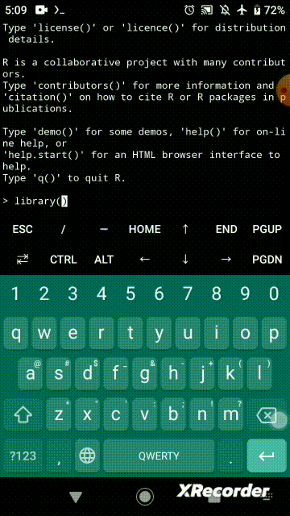

# Androidスマホの中でRを動かす

あきる（[paithiov909](https://github.com/paithiov909)）

---

## みなさん、

# **「俺のAndroidの中では<br />　Rが動くんだぜ！！」**

## というネタをしたいと思いませんか？



---

## 必要なもの

* **充分な作業時間**
* スマホ（Android 5.0以上, SoCがAArch64, ARM, i686, x86_64 いずれかのもの）
  * **数GBくらいのストレージ容量**
  * ここでは「Xperia XZ1（SoC: Snapdragon 835 (=AArch64), メモリ: 4GB）」で試しています
  * 時間かかる&ストレージ容量を食うので、普段使っていないスマホがよさそう
* WiFi
* PC（SSHクライアント越しに作業するとキーボードが使えて楽）

---

## スマホでRを動かすための構成

1. Termux
2. proot-distro
3. Debian

---

## [Termux](https://termux.dev/en/)

* 端末エミュレータとLinuxライクなシステム環境がセットになったAndroidアプリ（野良アプリ）
* [F-Droid](https://f-droid.org/)というアプリマーケットからインストールする

## [proot-distro](https://github.com/termux/proot-distro)

* [PRoot](https://github.com/proot-me/PRoot/)というプログラムをTermux上で動かせるようにしたもの
* ArchLinux, Fedora, Debian, UbuntuなどをTermuxのなかで動かすことができる

---

## Termux via OpenSSH

```sh
$ pkg update # `apt`の代わりに`pkg`を使う
$ pkg upgrade
$ pkg install openssh iproute2

$ ip -4 a # スマホのIPアドレス確認
$ id # ユーザー確認 uid=xxxxx(u0_axxx)を探す/u0_axxxがユーザー名
$ passwd # パスワード設定
$ sshd # OpenSSHサーバーの起動
# $ pkill sshd # SSHサーバーの終了 Termuxアプリを閉じるでもよいと思う
```
* 参考：[【西川和久の不定期コラム】root化せず気軽にAndroidスマホでLinux「Termux」！PHP+Apache+MariaDBを入れてWordpressを動かしてみる - PC Watch](https://pc.watch.impress.co.jp/docs/column/nishikawa/1409411.html)

---

## PRootとLinuxディストリビューションの導入

```sh
$ pkg install proot proot-distro
$ proot-distro install debian
$ proot-distro login debian --isolated # rootでログインする

# $ proot-distro login debian --isolated --user <ユーザー名> # ユーザーを作ってからはこっち
# $ proot-distro reset debian # Linux環境のリセット
# $ proot-distro remove debian # Linux環境の削除
```

* LinuxディストリビューションはUbuntuなども選べる
  * スマホのアーキテクチャにあわせて、Rをインストールしやすいものを選ぶのがコツ
* ArchLinuxでは、Rパッケージの読み込み時にターミナルが反応しなくなることがある
  * `proot-distro login archlinux --no-link2symlink`というオプションが必要？

---

## Debianのセットアップ

```sh
$ apt update
$ apt install wget vim sudo # 必要そうなものを適当に入れる
$ apt install r-base
# $ apt install r-cran-tidyverse # ストレージを大量に消費するので、Rを試したいだけなら不要
```

* あとは普通にLinuxの環境を整えるのと一緒です
  * 必要なものをインストール、ユーザーをつくる、sudoerに追加...
* [Debian Packages of R Software](https://cran.r-project.org/bin/linux/debian/#supported-branches)の説明にしたがって最新のRを入れようとすると、AArch64向けのバイナリがないらしくて入らない
  * Debianの公式リポジトリにあるちょっと古いやつなら入れられる
  * `apt install r-cran-*`で入るRパッケージについては、aptでインストールしたほうがトラブルが少ないはず

---

## Pros

* **スマホでRが動くと自慢できる！！**

## Cons

* グラフィックデバイス周りはよくわからない
* 遅いので実用上は使えません

---

# **Enjoy!!** 😉🥰😎


